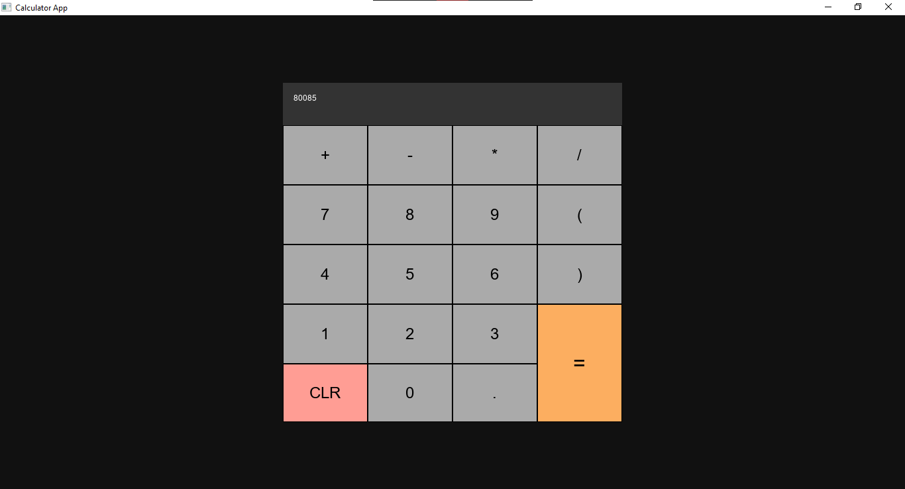

# Simple Calculator App



Written as a sample Cerulean UI app to demonstrate Layouts, Styles, Grids, Panels, Labels and Buttons.

## Requirements

- .NET 6.0
- Cerulean.CLI

## Getting Started

> **Warning**
> This section is subject to change once Cerulean UI 1.0 releases.

1. Clone the repository and the submodules.
   ```bash
   git clone https://github.com/Xapier14/Calculator.git --recurse-submodules
   ```
2. Change into the project directory and build the XMLs.
   ```bash
   cd Calculator
   crn build-xml
   ```
3. Build and run the .NET C# project
   ```bash
   dotnet run
   ```

## Layout Tree

- MainLayout (Layout)
  - ResponsiveGrid (Grid [3x3])
    - BaseGrid (Grid [1x2])
      - DisplayPanel (Panel)
        - DisplayLabel (Label)
      - ButtonGrid (Grid [4x5])
        - OperationsGrid (Grid [4x1])
          - ButtonAddition (Button)
          - ButtonSubtraction (Button)
          - ButtonMultiplication (Button)
          - ButtonDivision (Button)
        - Button9 (Button)
        - Button8 (Button)
        - Button7 (Button)
        - Button6 (Button)
        - Button5 (Button)
        - Button4 (Button)
        - Button3 (Button)
        - Button2 (Button)
        - Button1 (Button)
        - Button0 (Button)
        - ButtonClear (Button)
        - ButtonEval (Button)
        - ButtonOpenParenthesis (Button)
        - ButtonCloseParenthesis (Button)
        - ButtonPeriod (Button)

> ResponsiveGrid has a fixed column[1] width of 512 and a fixed row[1] height of 512.

> BaseGrid has a fixed row[0] height of 64.

> The buttons and grids (ButtonGrid, OperationsGrid) are anonymous components. These cannot be referenced from the backing code.
